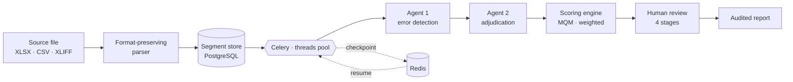

## Jawad Yousaf

**Backend Engineer** · Django · Distributed task pipelines · LLM infrastructure

I build the unglamorous half of AI products — the queueing, the retries, the idempotency,
the cost accounting, and the parsers that survive whatever a customer actually uploads.

`Pakistan` · [LinkedIn](https://linkedin.com/in/jawad-yousaf-devloper360) · [Portfolio](https://personal-portfolio-seven-amber-80.vercel.app/) · `hafizjawad858@gmail.com`

---

### Currently

Backend for a **language-quality-assurance platform** — an AI pipeline that scores translated
content against the MQM error taxonomy, then routes every segment through a multi-stage human
review workflow before producing an auditable quality report.

<table>
<tr><td width="50%" valign="top">

**Concurrency & reliability**

Celery on a threads pool so `asyncio.gather` can fan out inside tasks. Semaphore-bounded
provider calls, Redis checkpointing per segment — a run stops, resumes or restarts
mid-file without losing work.

</td><td width="50%" valign="top">

**Provider abstraction**

One interface over OpenAI, Anthropic, Google and AWS Bedrock. Per-model pricing sync
and pre-flight cost estimation, so a job is priced before it is allowed to start.

</td></tr>
<tr><td valign="top">

**Scoring engine**

Client-configurable severity weights, per-category penalties and pass thresholds.
One formula, four surfaces, and the guardrails that keep them from drifting apart.

</td><td valign="top">

**Format fidelity**

Parsers for XLSX, CSV and four XLIFF dialects with lossless inline-tag round-trip —
a translated file comes back out intact, tags and all.

</td></tr>
</table>

---

### Stack

| | |
|---|---|
| **Core** | Python · Django 5 · Django REST Framework |
| **Data** | PostgreSQL · Redis |
| **Async** | Celery · asyncio |
| **Infra** | Docker · AWS (S3, SNS, Bedrock) · Nginx · Gunicorn |
| **Interfaces** | REST · WebSockets · HMAC-signed partner APIs |

---

### How I work

> **Root cause over symptom.** One guard in the shared function beats a guard in every caller.
>
> **Boring beats clever.** Clever is what someone has to decode at 3am.
>
> **Deletion is a feature.** The best code is the code that never needed to exist.

---

### Selected work

Pinned below — real-time messaging on Django Channels, a JWT auth API in DRF,
a Dockerised WebSocket service, and transformer fine-tuning for text classification.
