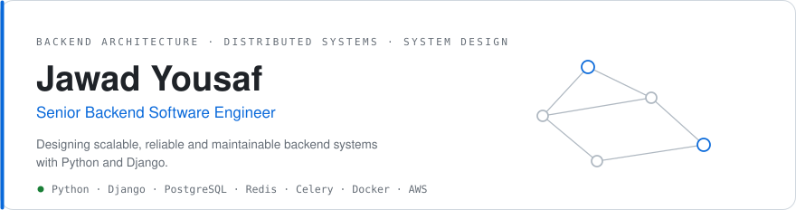
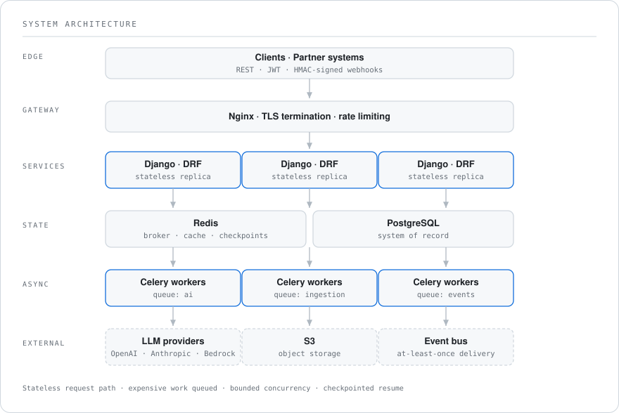

<picture>
  <source media="(prefers-color-scheme: dark)" srcset="assets/hero-dark.svg">
  
</picture>

<p align="center">
  <a href="https://github.com/SheikhJawad"><b>GitHub</b></a> &nbsp;·&nbsp;
  <a href="https://linkedin.com/in/jawad-yousaf-devloper360"><b>LinkedIn</b></a> &nbsp;·&nbsp;
  <a href="https://personal-portfolio-seven-amber-80.vercel.app/"><b>Portfolio</b></a> &nbsp;·&nbsp;
  <a href="mailto:hafizjawad858@gmail.com"><b>Email</b></a>
</p>

---

## About

I build backend systems that stay correct under load and under failure.

Most of my work sits behind the API: service boundaries, queue topology, database design,
asynchronous processing, and the failure paths that never make it into a demo. I care about
the properties that decide whether a system survives its second year — idempotency,
backpressure, observability, and the ability to resume rather than restart.

Recently that has meant putting LLM providers into production paths, where latency is
unpredictable, failure is routine, and cost is a first-class constraint.

---

## Engineering focus

<table>
<tr>
<td width="25%" valign="top"><b>Architecture</b><br><sub>Service boundaries · API design · domain modelling · migration strategy</sub></td>
<td width="25%" valign="top"><b>Distributed systems</b><br><sub>Queue topology · delivery guarantees · idempotency · checkpointed resume</sub></td>
<td width="25%" valign="top"><b>Data</b><br><sub>Relational modelling · query performance · caching · consistency boundaries</sub></td>
<td width="25%" valign="top"><b>Production</b><br><sub>Containerised deploys · structured logging · failure budgets · cost control</sub></td>
</tr>
</table>

---

## Architecture &amp; system design

<picture>
  <source media="(prefers-color-scheme: dark)" srcset="assets/architecture-dark.svg">
  
</picture>

<table>
<tr><td width="50%" valign="top">

**Stateless request path**

The API tier owns no long work. Every expensive operation becomes a queued job with its own
worker pool, so a slow downstream degrades one queue instead of the request path.

</td><td width="50%" valign="top">

**Delivery guarantees**

Outbound events are at-least-once, so receivers must tolerate replay. Idempotency is claimed
atomically at the row level — a double-fire becomes a no-op rather than a duplicate.

</td></tr>
<tr><td valign="top">

**Backpressure and resume**

Bounded concurrency on external calls, with per-unit checkpoints in Redis. A run stops,
resumes or restarts mid-workload without replaying completed work.

</td><td valign="top">

**Cost as a constraint**

For LLM-backed paths, per-model pricing is synced continuously and estimated pre-flight.
Work is priced before admission rather than discovered on the invoice.

</td></tr>
</table>

---

## Stack

| | |
|---|---|
| **Backend** | Python · Django · Django REST Framework · FastAPI |
| **Data** | PostgreSQL · Redis |
| **Distributed / async** | Celery · message queues · WebSockets · asyncio |
| **Infrastructure** | Docker · AWS (S3, SNS, Bedrock) · Nginx · Linux |
| **AI** | LLM APIs · embeddings · RAG · agent orchestration |

---

## Selected engineering work

<table>
<tr><td width="50%" valign="top">

### Distributed LQA platform
`Django` `PostgreSQL` `Redis` `Celery` `AWS`

**Problem** — score large volumes of translated content with LLMs, then route every unit
through a multi-stage human review workflow without losing state.

**Architecture** — stateless API tier, worker fleets split by queue, provider-agnostic LLM
layer, Redis checkpointing for stop/resume/restart, event-driven partner integration.

**Result** — long-running AI workloads that survive provider failure and resume from the
last committed position instead of the beginning.

<sub>Professional work — source not public.</sub>

</td><td width="50%" valign="top">

### Real-time messaging service
`Django Channels` `WebSockets` `Redis`

**Problem** — deliver bidirectional messages to grouped clients with authenticated sessions.

**Architecture** — WebSocket consumers over Django Channels, Redis-backed channel layer for
group broadcast, session-backed authentication on connect.

**Result** — persistent connections with server-initiated delivery, no polling.

[**View repository →**](https://github.com/SheikhJawad/Django_ChatApp)

</td></tr>
<tr><td valign="top">

### JWT authentication API
`Django REST Framework` `PostgreSQL`

**Problem** — issue and rotate credentials for API clients without server-side session state.

**Architecture** — DRF viewsets with access/refresh token pairs, rotation and blacklisting,
permission classes enforced at the view boundary.

**Result** — a stateless auth layer that scales horizontally with the API tier.

[**View repository →**](https://github.com/SheikhJawad/user_management-api)

</td><td valign="top">

### Containerised streaming service
`Django` `WebSockets` `Docker`

**Problem** — run a stateful streaming service reproducibly across environments.

**Architecture** — docker-compose topology, structured logging split by level, environment
configuration externalised from the image.

**Result** — identical local and deployed behaviour from one image definition.

[**View repository →**](https://github.com/SheikhJawad/websocket_streaming)

</td></tr>
</table>

---

## Engineering philosophy

> **Fix the cause, not the call site.** One guard in the shared function beats a guard in every caller — and the callers you forgot are the incident.
>
> **Boring code wins.** Clever is what someone has to decode at 3am with a pager going off.
>
> **Deletion is a feature.** The most reliable code is the code that never needed to exist.
>
> **Design for the second year.** Anything can be made to work once. Systems are judged by what happens after the person who built them moves on.

---

## Currently exploring

```text
→  High-throughput Django architecture beyond the request/response cycle
→  Distributed systems — consensus, partitioning, delivery semantics
→  LLM infrastructure — evaluation, cost modelling, agent orchestration
→  Observability as a design input rather than an afterthought
```

---

<h3 align="center">Building something that has to stay up?</h3>

<p align="center">
  Happy to talk architecture, backend engineering, or putting AI systems into production.
</p>

<p align="center">
  <a href="mailto:hafizjawad858@gmail.com"><b>Email</b></a> &nbsp;·&nbsp;
  <a href="https://linkedin.com/in/jawad-yousaf-devloper360"><b>LinkedIn</b></a> &nbsp;·&nbsp;
  <a href="https://personal-portfolio-seven-amber-80.vercel.app/"><b>Portfolio</b></a>
</p>
