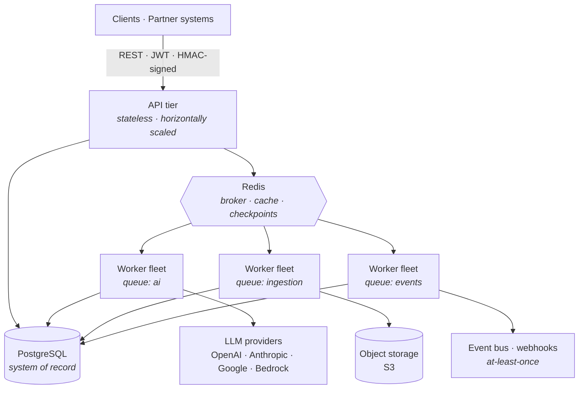

## Jawad Yousaf

**Backend Engineer** · Distributed systems · Service architecture · LLM infrastructure

I design and run the unglamorous half of AI products — service boundaries, queue topology,
idempotency, backpressure, and the failure paths nobody demos.

`Pakistan` · [LinkedIn](https://linkedin.com/in/jawad-yousaf-devloper360) · [Portfolio](https://personal-portfolio-seven-amber-80.vercel.app/) · `hafizjawad858@gmail.com`

---

### System design

A platform I own the backend of: a stateless API tier, an autonomous worker fleet split by
queue, and event-driven integration with partner systems. Scaled independently, deployed
independently, failing independently.

<table>
<tr><td width="50%" valign="top">

#### Service boundaries

API tier stays stateless and owns no long work. Every expensive path is a queued job with
its own worker pool, so a slow provider degrades one queue instead of the request path.

</td><td width="50%" valign="top">

#### Delivery guarantees

Outbound partner events are at-least-once, so receivers must tolerate replay. Idempotency
claimed atomically at the row level — a double-fire is a no-op, not a double charge.

</td></tr>
<tr><td valign="top">

#### Backpressure & resume

Semaphore-bounded provider calls, per-unit checkpointing in Redis. A run stops, resumes or
restarts mid-file without replaying completed work or losing position.

</td><td valign="top">

#### Cost as a constraint

Per-model pricing synced continuously and estimated pre-flight. A job is priced before it
is admitted, not discovered after the invoice.

</td></tr>
</table>

---

### Stack

| | |
|---|---|
| **Core** | Python · Django 5 · Django REST Framework |
| **Data** | PostgreSQL · Redis |
| **Async** | Celery · asyncio · multi-queue routing |
| **Infra** | Docker · AWS (S3, SNS, Bedrock) · Nginx · Gunicorn |
| **Interfaces** | REST · WebSockets · HMAC-signed partner APIs · webhooks |

---

### How I work

> **Root cause over symptom.** One guard in the shared function beats a guard in every caller.
>
> **Boring beats clever.** Clever is what someone has to decode at 3am.
>
> **Deletion is a feature.** The best code is the code that never needed to exist.

---

### Selected work

Pinned below — real-time messaging on Django Channels, a JWT auth API in DRF,
a Dockerised WebSocket service, and transformer fine-tuning for text classification.
